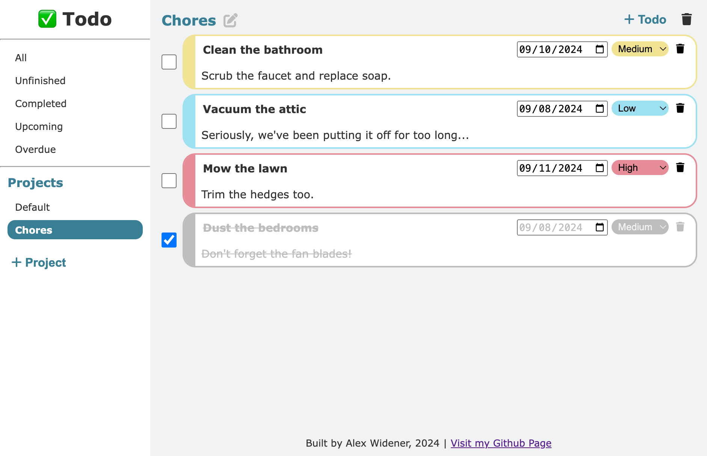

# To-Do

This is a simple Todo list project that allows users to create Todos, set their due dates and priorities, assign them to specific projects, and check them off when they are completed.

This project utilizes [OOP](https://en.wikipedia.org/wiki/Object-oriented_programming) to build the UI outside of basic foundational elements, and to also handle the business logic associated with Todos and Projects.

[Live preview](https://awidener3.github.io/to-do/)

## Requirements
This project comes from the [To-do List assignment from The Odin Project.](https://www.theodinproject.com/lessons/node-path-javascript-todo-list) Therefore, certain requirements had to be met:

- Each todo must have a `title`, `description`, `dueDate`, and `priority`. I included a `completed` status to this list.
- It also required there to be a `project` feature, or separated lists of todos.
- It required the ability to view all todos, view all todos per project, delete a todo, and expand a todo. I opted to remove the expand requirement, as I was pleased with the UI I had created for each todo element.
- Todos also needed to be able to survive page refreshes, so `localStorage` was utilized to prevent lost data.
